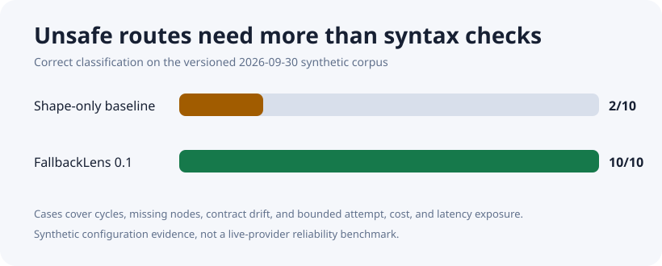
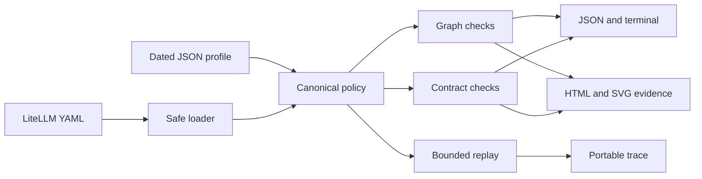

# FallbackLens



FallbackLens audits LLM retry and fallback policies before they reach production. It imports a LiteLLM YAML route graph, joins it with explicit model facts and workload contracts, then checks graph finiteness, capability preservation, context capacity, privacy requirements, and conservative attempt, cost, and latency exposure. It can also replay declared failures without calling a model provider.

The intended user is an AI platform engineer who needs evidence that a fallback still satisfies an agent's contract. FallbackLens is not a gateway, a model selector, or a claim that static linting proves production reliability.

## Why this exists

LLM gateways make fallback execution convenient, but a syntactically valid policy can still:

- contain a cycle that amplifies retries;
- move a tool-using agent to a model without tool or JSON-schema support;
- reduce the usable context window;
- cross a zero-data-retention boundary;
- exceed a declared attempt, cost, or latency budget.

Current LiteLLM source was inspected at commit `50f5cc9bbb55bacecd3c0f07623566df6a04e1df` on 2026-09-30. Its `Router.validate_fallbacks` function verifies that entries are one-key dictionaries, but does not reject graph cycles. [LiteLLM issue 35303](https://github.com/BerriAI/litellm/issues/35303) documents a production incident on v1.93.0 in which a cyclic fallback graph contributed to 79,858 attempts from one request. The issue is closed as a duplicate, so this is problem evidence, not a claim that every current runtime path is still vulnerable.

## What is original here

FallbackLens does not rebuild provider access, load balancing, or learned model selection. Its contribution is a reviewable preflight layer that combines four dimensions normally handled separately:

1. Graph safety across general, context-window, and content-policy fallback edges.
2. Path-wide workload contracts for tools, structured output, context, and retention.
3. Conservative attempt, cost, and p95-latency exposure using dated operator facts.
4. Bounded deterministic failure replay with portable JSON traces.

## Quick start

Requirements: Python 3.10 or newer.

```bash
python -m venv .venv
.venv/Scripts/python -m pip install -e .

fallbacklens audit examples/litellm-safe.yaml \
  --profile examples/profile-safe.json \
  --json artifacts/safe-audit.json \
  --html artifacts/safe-audit.html \
  --svg artifacts/safe-graph.svg
```

On macOS or Linux, use `.venv/bin/python` and `.venv/bin/fallbacklens`.

Expected terminal result:

```text
FallbackLens: 0 error(s), 0 warning(s)
Graph: 3 model group(s), 4 fallback edge(s), retries=1
Contract tool-agent: paths=2, attempts=6, cost=$0.048000, latency=10000.0 ms
```

Replay two offline failure scenarios:

```bash
fallbacklens simulate examples/litellm-safe.yaml \
  --scenarios examples/scenarios.json \
  --json artifacts/scenario-replay.json
```

Run the comparison corpus:

```bash
fallbacklens benchmark benchmarks/policy-cases-v1.json \
  --json artifacts/benchmark.json \
  --svg docs/assets/policy-benchmark.svg
```

Exit codes are `0` for a passing audit or matched replay, `1` for policy findings at the selected threshold or an expectation mismatch, and `2` for invalid input or I/O errors.

## Inputs and assumptions

The LiteLLM adapter reads:

- `model_list[].model_name`;
- `router_settings.num_retries`;
- `router_settings.fallbacks`;
- `router_settings.context_window_fallbacks`;
- `router_settings.content_policy_fallbacks`.

The JSON profile supplies operator-owned facts. Each profile must include an `as_of` date and at least one source note. Model facts cover capabilities, context window, per-million input/output prices, p95 latency, and zero-data-retention status. Contracts declare the entrypoint, workload needs, expected token volumes, and maximum exposure.

FallbackLens does not scrape mutable provider catalogs. Unknown data produces warnings rather than invented values. Demo model names and facts are synthetic.

## Architecture



The canonical engine is separate from the LiteLLM loader so future adapters do not need to duplicate cycle, contract, or exposure logic.

## Reference landscape

| System | What it does well | Boundary relevant to FallbackLens |
|---|---|---|
| [LiteLLM](https://github.com/BerriAI/litellm) | Broad provider support, OpenAI-compatible proxy, retries, fallbacks, budgets, and many routing strategies | Runtime breadth is high; the inspected fallback validator does not prove graph finiteness or path-wide workload contracts |
| [Portkey Gateway](https://github.com/Portkey-AI/gateway) | Retries, fallbacks, guardrails, caching, observability, and agent integrations | Executes policies but does not provide this small provider-neutral static contract proof |
| [OpenRouter provider routing](https://github.com/OpenRouterTeam/docs/blob/main/guides/routing/provider-selection.mdx) | Hosted provider ordering, availability fallback, parameter filtering, and data-retention controls | Per-request hosted routing is different from auditing an independent multi-hop graph offline |
| [RouteLLM](https://github.com/lm-sys/RouteLLM) | Learned strong-versus-weak model selection with cost-quality benchmarks | Evaluates model choice, not retry graph safety or fallback contract drift |

The full dated comparison, activity snapshot, issue evidence, licenses, and Applied ML discovery check are in [`docs/notes/2026-09-30-reference-review.md`](docs/notes/2026-09-30-reference-review.md).

## Verified evidence

The bundled `fallback-policy-safety-v1` corpus contains ten synthetic policies: one valid graph and nine defects spanning malformed entries, cycles, unknown targets, capability loss, context loss, privacy drift, and attempt, cost, and latency budgets.

| Evaluator | Correct cases | Accuracy |
|---|---:|---:|
| Shape-only baseline | 2 / 10 | 20% |
| FallbackLens 0.1 | 10 / 10 | 100% |

This corpus is deliberately small and targets implemented rules. It is regression evidence, not a live-provider benchmark and not an estimate of real-world defect prevalence.

The safe demo produced 0 errors and 0 warnings. With one retry per model group, its longest path exposes at most 6 configured attempts, `$0.048000` under the supplied token-price assumptions, and `10000.0 ms` under the supplied p95-latency assumptions. The risky demo produced `FALLBACK_CYCLE` and `UNBOUNDED_ROUTE` errors.

Local verification on Python 3.14.7:

```bash
python -m unittest discover -s tests -v
python -m compileall -q src tests
python -m pip check
python -m build
```

All 15 tests passed. Browser QA covered 1280-class desktop rendering and a 390 by 844 viewport. The narrow report had no page-level horizontal overflow, tables scrolled inside their containers, and the console had no warnings or errors. Exact evidence is recorded in [`docs/experiments/2026-09-30-verification.md`](docs/experiments/2026-09-30-verification.md).

GitHub Actions also passed the complete suite, audit, replay, comparison, dependency audit, and package build on Python 3.10, 3.12, and 3.14.

## Safety and interpretation

- YAML is parsed with `yaml.safe_load`; arbitrary Python object construction is rejected by test.
- Reports never need API keys, prompts, or model responses.
- Cost and latency figures are conservative configured exposure under supplied assumptions. They are not predicted bills or SLOs.
- A passing audit says the declared static facts and graph satisfy the declared contracts. It does not prove endpoint health, output quality, provider terms, billing behavior, or version-specific retry semantics.
- Before production use, replace all synthetic facts with dated official provider documentation and run live fault injection in a safe environment.

## Limitations

- Version 0.1 imports only the listed LiteLLM routing fields.
- Group-level facts do not model different deployments inside one model group.
- Exposure assumes every configured attempt consumes the declared full token and p95-latency amount. Real failures may be cheaper, faster, slower, or billed differently.
- Static capability and retention facts can become stale.
- The replay engine follows the first matching fallback edge. It is a bounded regression model, not an exact emulator of every LiteLLM release.
- There is no live-provider adapter, traffic capture, concurrency model, cooldown simulation, or probability-weighted expected cost.
- The ten-case corpus was designed around implemented checks and is not independent validation.

## Best next improvement

Add trace import for LiteLLM/OpenTelemetry events, compare declared bounds with observed attempts and latency, and flag semantic drift between the configured graph and real gateway behavior while keeping prompts and credentials out of reports.

## Project records

- [Approved implementation spec](docs/superpowers/specs/2026-09-30-fallbacklens-v0.1.md)
- [Reference review](docs/notes/2026-09-30-reference-review.md)
- [Decision record](docs/decisions/2026-09-30-static-contract-audit.md)
- [Dataset card](docs/datasets/fallback-policy-safety-v1.md)
- [Model card](docs/models/no-model.md)
- [Verification record](docs/experiments/2026-09-30-verification.md)
- [Asset provenance](docs/notes/2026-09-30-asset-provenance.md)

## License

MIT. FallbackLens is an independent project and is not affiliated with LiteLLM, Portkey, OpenRouter, or RouteLLM.
